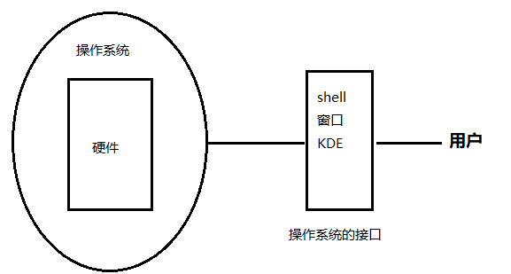

# Shell-Bash

[TOC]

教程：https://github.com/dylanaraps/pure-bash-bible.git

## shell

**定义**
内核 Kernel 管理计算机的硬件，内核需要被保护，一般用户只能通过 shell 来和内核通信。

shell 提供用户操作系统的接口

**为什么要学习 命令行 shell**

1. 各个 linux 系统发行版的 shell 通用
2. 方便远程管理

**shell 的种类**
bourne again shell, C shell, k shell, tcsh, bourne shell(sh)
Linux 使用 bourne again shell，即 bash, bash 兼容 sh

可以利用 `cat /etc/shells` 命令查看 linux 提供的 shell，默认使用 bash 

## Bash

**Bourne Again SHell**

Linux 是多用户、多任务的环境，每个人登录系统都能取得一个 bash。

bash 是 Linux 中的 标准 shell，优点如下：

1. 命令记忆能力：history
2. 命令与文件补全功能：tab
3. 程序脚本：shell script 小型程序语言
4. 通配符

进入子进程，打开一个新的 shell：`bash`



## 变量相关

1. 环境变量通常用大写字符表示
2. 变量在被显示时，前面必须加上字符 "$"
3. 显示变量
   `echo $variable, echo $PATH`
4. 赋值符号 = 两边不能加空格
5. 设置变量： `myname=wanshuo`,这一这里 wanshuo 就是字符串，不需要加  " "
6. 变量内如果有空格符，那么可以用 "" 或 '' 将内容结合，但是 " " 内的特殊字符如 $，可以保持原本的特性，例如 
   `var="lang is $LANG" 则 echo $var 可得 lang is en_US`，而 ' ' 内的所有字符都成了一般字符
7. 增加变量内容：`varname="$varname"增加的内容`
   例如增加环境变量 ：`PATH="$PATH":/home/work `
8. 如果变量需要被子进程使用，那么 需要用 export 来使变量变成环境变量：`export varname`
9. 大写的变量通常为系统的环境变量，在任何进程下通用，小写的变量通常为用户在某个进程下自定义的变量
10. 取消变量：`unset 变量名`
11. 转义字符 `\` 可以对特殊符号 `回车、空格、$ 、！ ` 进行转义
12. 在命令中运行命令，例如：

```script
version=$(uname -r) 或者
version=`uname -r` 运行命令，把结果复制给一个变量
echo $version 结果为 版本号
```

13. 查看所有变量的命令 ：`set`

## 环境变量

1. 查看环境变量的命令：`env`，`export`

### PS1 变量

PS1 变量用于设置 命令提示符，即 `[work@yq01-yq-qadev-wanshuo wanshuo]$`
打印 PS1 变量：`echo $PS1`，结果为：`[\u@\h \W]\$`，其中，[ ] 代表命令提示符的框框，PS1 变量的内容类似于正则表达式,
\u 表示目前用户的账号，@ 就是正常的 @ 字符， \h 表示取主机名在第一个小数点之前的名字， \W 表示工作目录最后一个目录名，
\$ 是提示符，root 的提示符为 #，非 root 用户提示符为 $。

设置 PS1 变量：`PS1='[.......]\$'`
默认设置成：PS1='[\u \W]\$'

### $ 变量

变量 $ 表示当前 shell 的线程代号 。
`echo $$`

### ? 变量

存储着上一个命令的回传码

每执行完一个命令，都会有一个回传码，如果命令正确并执行完毕，那么回传码为 0，如果命令错误，执行错误，就会传回来一个非 0 的值。

````
12name=wanshuo
echo $?
这里会传回一个第一个命令运行结果码，由于赋值错误，打印出来的值应该是一个非 0 的数。
````

### 环境变量 和 自定义变量的区别
1. `env` 命令专门用来查询环境变量
2. `set` 命令可以查询所有的变量
3. 两者区别在于 该变量是否会被子进程所继续引用，当利用 `bash` 命令进入一个子进程后，父进程的变量就失效了，`子进程只能继承父进程的环境变量`。 `export 变量名` 命令用于将普通变量提升为环境变量。
4. 单独的 'export' 命令可以列出所有的环境变量。
5. 环境变量 == 全局变量， 自定义变量 == 局部变量

## read 命令 读取来自键盘的输入

`read [-pt] variable`
`-p 后面接提示符`
`-t 后面接等待的秒数`

```
Demo

read atest
输入内容
echo $atest

read -p "请输入用户名" -t 30 name  # 等待30秒让用户输入用户名，并把值赋给 name 
```
## 声明变量类型 declare / typeset
`declare [-aixr] variable`
`-a 将 variable 定义为数组类型`
`-i 定义为整数数字类型`
`-x 作用和 export 一样，都是将变量变成环境变量`
`-r 将变量设置为 readonly 类型`

```
Demo

declare -i sum=1+2+3
echo $sum

declare -r sum # 设置 sum 只读
declare -x sum # 设置 sum 为环境变量
declare +x sum # 取消 sum 的环境变量属性

#定义数组
var[1]="str1"
var[2]="str2"
```

linux 中变量的类型默认为 字符串 类型，bash 环境中的数值运算，默认最多支持整数类型，所以 1 / 3 = 0

## script 脚本编程经验
1. 命令太长要换行，用 `\` 将换行符转义
2. 写 shell 脚本应该直接在 vim 环境下写，如果在 windows 下写，会出现各种格式问题，导致命令无法执行
3. 

## shell 编程 Demo
    #!/bin/bash 
    # -v 是排除 grep 进程本身， print $2 是获取第二个参数，也就是 PID，反引号是为了运行后面的脚本
    pid=`ps -fe | grep "python cpu_consume.py" | grep -v grep | awk '{print $2}'` 
    kill $pid
    python /home/work/cpu_consume/cpu_consume.py
    exit 0