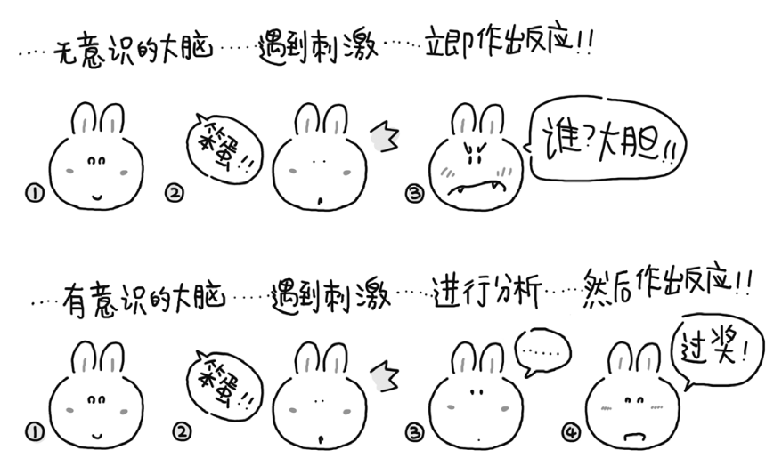

# Time-as-a-Friend

GitHub: [Time-as-a-Friend](<https://github.com/xiaolai/time-as-a-friend>)

## 阅读说明

* **时间不可管理，一切都靠积累**
* 很多“时间管理技巧”并非无用，但往往由于使用者心智能力低下甚至尚未开启心智，致使那些技巧只能治标，不能治本，甚至既不治标，也不治本
* 基于比较的成功观，是伤人的、害人的。事实上，对年轻人来说，**成长比成功更重要**，而且，这才是人人都可以做到的事情，才是人人都值得追求的事情。而**成长其实只有一条路——积累**
* 人的理性建立在接受现实的基础上，不能接受现实，一切成长都是虚妄

## 第 0 章：困境

**时间无法管理，我们能管理的，只有自己**

* 我教过很多学生。他们中的绝大多数都一样，压力刻在额头，匆忙写在脸上。他们身上充满了矛盾——他们“**既勤奋又懒惰**”
* 只有学会正确地思考，才意味着真正进化成人，没有人愿意做猴子
* “没时间了”，是“时间恐慌症”患者脑子里唯一反复闪现的一句话。巨大的压力，极度的恐慌，使“患者”身上综合了一切矛盾：他们既勤奋又懒惰，既聪明又愚蠢，既勇敢又懦弱，既满怀希望又分分秒秒面临绝望，既充满自信又随时随地体会自卑
* 战略上藐视，战术上重视
* 生活中明显有另外一些人——尽管数量上并不占优——在用另外一种状态生活。他们从容，他们优雅，他们善于化解各种压力，安静地去做他们认为应该做的事情，并总能有所成就。他们甚至可以达到常人无法想象的境界——不以物喜，不以己悲
* 很少有人会注意，所谓“管理时间”抑或“时间管理”是虚假的概念，是不可能完成的任务。时间不会服从任何人的管理，它只会自顾自地流逝
* 问题出在我们自己身上，我们无法管理时间。**我们真正能够管理的，是我们自己**
* **人们很难接受与已有知识和经验相左的信息或观念**，因为一个人已有的知识和观念都是经历过反复筛选的。尽管很多知识和观念是被灌输的，但知识的持有者对“被灌输”这一事实往往毫无察觉，就算察觉，也可能拒绝承认。人们更愿意相信自己拥有一定的判断能力，不会被轻易糊弄。即使是一些“想当然”的观念，人们也倾向于认为那是“思考过后的结论”

## 第一章：醒悟

**学会独立的思考，成为大脑的主人**

* 我们用自己的大脑进行思考，然而我们思考的方式和结果往往受上一次思考的方式和结果影响，同时也会影响下一步思考的方式和结果

* **我们甚至可以思考我们的思考方式和思考结果是否确实是合理的思考方式和思考结果**

* **你的大脑并不是你，你的大脑是（属于）“你的”大脑**，我究竟是被大脑控制，还是在控制自己的大脑

* 你“可以控制你的大脑”——分清主仆很重要

  

* 在最为艰苦的岁月里，他选择了积极向上的态度。他没有悲观、绝望，相反，他在脑海中设想，自己重获自由之后该如何站在讲台上，把“关于集中营的心理学”讲给来宾们听。凭着这种积极、乐观的思维方式，尽管身处集中营，弗兰克却可以让自己的心灵越过牢笼的禁锢，在自由的天地里任意翱翔

* “**运用心智获得解放**”。不要再让自己“跟着感觉走”，成为大脑的奴隶，而是翻身做大脑的主人

* 一个人的心智就是其过往获得的一切知识及经验的总和（包括基于这些知识和经验造就的思考方法、思考模式）。心智与智商不同。大多数人都拥有正常的智商，但并非每个拥有正常智商的人都拥有正常的心智

* 骗子想要成功行骗,必须把想让别人相信的谎言掺到大量的真理之中。鬼话连篇是骗不了人的

* 我的成长轨迹，和笑来极其的相似。笑来因为编写教材，赚得了**第一桶金**，而我因为编写了考研辅导资料，赚得了第一桶金

* 技多不压身，只管学习，剩下的交给时间

## 第二章：现实

**面对问题，接受现实，一分耕耘，一分收获**

* **一分耕耘，一分收获**，No pain, no gain ——> 推迟满足感

* 酗酒疯狂无度的、嫖娼乐此不疲的、吸毒罔顾死活的，都是这种“希望自己的欲望马上得到满足的天性”使然。更要命的是，几乎整个社会都在用各种各样的方式**刺激人们发挥这种天性**，并愈演愈烈。电视上的减肥广告告诉你，减肥药都功能神奇，当天见效。报纸上的医疗广告告诉你，无论得了什么病都不要怕，找他一准手到病除。公交上的培训广告告诉你，不管学什么都要速成，因为人生苦短

* 接受现实。**告诉自己：我有不足，我需要时间，我没办法一蹴而就**

* [大不列颠语料库](http://goo.gl/uyr9E)的统计数据表明，最常与“完美主义者”（perfectionist） 这个词一并出现的是“脆弱的”（**vulnerable**）。没有人能够做到完美。我们至多能做到接近完美，或者更接近完美

  

* 人就是这样，装得久了，就装得像了；装得太像、太久，不管事实怎样，自己倒是先信了

* 这些人所说的“做不好”，其实是“不能一下子做好”，但问题在于，没有什么事情是一下子就能做好的

* 一些真正优秀的人，也会被别人称作“完美主义者”。事实上，这种描述并不准确。比较准确的说法应该是“他们是有能力做到更接近完美的人，并且，他们一直在努力” ——> Follow Excellence，Success will Follow you.

* 我们必须接受这个现实——未知永远存在。而后，我们只能不断地尝试着去适应“在未知中不断前行”，如果不能接受这个现实，就无法忍受未知的存在，也会平添无数的焦虑。焦虑是导致时间浪费、效率低下的根源之一

## 第三章：管理

* 诺维格表示，人们购买那种名字类似“7天自学Java语言”的书是无知的表现，他认为，用10年时间学习程序设计才真正现实，也非常值当

* 任何领域的卓越成就都必须用一生的努力才能取得；稍微低一点代价都无法换来

* 为什么随着年龄的增长每个人都会觉得时间过得越来越快

  对一个5岁的孩子来讲，未来的1年相当于他已经度过的人生的¹⁄₅，即20%；而对一个50岁的成年人来讲，未来的1年只相当于他已经度过的人生的¹⁄₅₀，即2%。所以，随着年龄的增加，人们会觉得时间运动得越来越快

* 明知自己拖延的人很痛苦，因为他们不是不知道该做什么，而是不知道为什么“**无法进入状态**”——这是他们能够想出来的对自己的行为最拿得出手的描述

* 一个人一旦开始认真做事，被嘲弄、被耻笑的几率将远远高于被夸奖、被鼓励的几率——这几乎是肯定的

* 如果一个人经常嘲弄他人，那只能说明他自己不怎么样；否则，他会像那些极少数已经做对、做好的人一样，给予别人真诚的鼓励而非嘲弄

* 很多人实际上根本不知道自己所谓的“喜欢做某件事情”很可能只是因为那件事情相对简单、容易获得奖励而已

* 他们每次回避困难的时候，都不是故意的，并且往往已经给自己找了恰当的借口。这借口太强大、太有力，以至他们真诚地相信：“我喜欢做有创意的事情，而现在手上的这些事情太枯燥，我确实提不起兴趣……”

## 第四章：学习

* 学习是投资回报率最高的行为