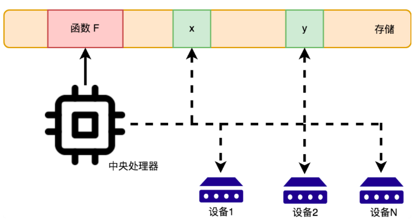
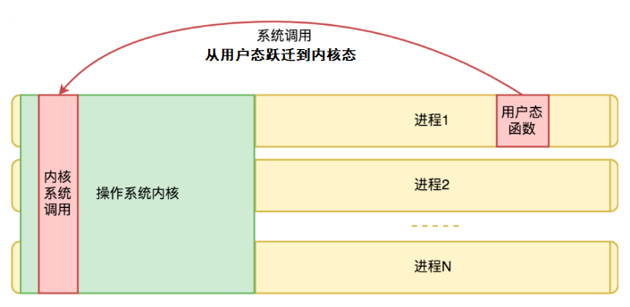
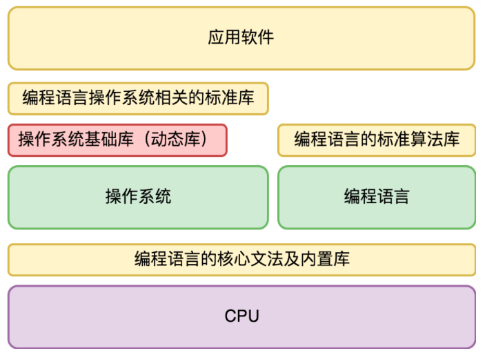

# 许式伟架构课

[TOC]

## 开篇词 怎样成长为优秀的软件架构师

* 软件架构师和软件工程师最根本的差别在于四个字：**掌握全局**。掌握全局，并不是成为全栈，核心在于对知识脉络的体系化梳理，这是架构能力构建和全面提升的关键。
* 如何成为优秀的软件架构师？一靠匠心，二靠悟心。
* 架构能力的提升，本质上是对你的**知识脉络（全身经络）的反复梳理与融会贯通**的过程。

## 第一讲 架构设计的宏观视角

谈及架构，基础才是最重要的，有了坚实的基础，才能起高楼。

### Google 赋予的浏览器的使命

客户端软件面临的是多样性的挑战。操作系统有 N 种，我们不能针对每一个操作系统都编写一套客户端，于是 Google 赋予了浏览器一个使命：**消除客户端的多样性，跨平台提供统一编程接口**。Google 之所以发力浏览器，有两个原因：

1. Google 已经丧失了桌面操作系统的控制权，所以其想把战场转到浏览器上，越来越多的开发人员在浏览器上做应用，从而导致底层操作系统管道化（操作系统成为数据流通的通道）。
2. 一次开发，多平台运行是大势所趋，Google 除了发力 Chrome，也有其他的尝试，例如：Flutter

## 第二讲 无生有 有生万物

### 冯诺依曼体系结构

冯的体系结构不仅是应用程序这座大厦的基石，同时也是整个信息科技的地基。冯诺依曼体系的三个基础零部件：

1. 处理器

2. 存储

   存储分为内存和外存。计算机存储的地位，如同人类发明了纸一样重要。

3. 输入输出设备

   CPU 与输入输出设备之间进行通信，本质上就是和 IO设备 进行数据的传输。

**处理器 + 存储 实现了无中生有，而 输入输出设备 实现了有生万物**。

### 输入输出设备的重要性

`y = f(x)` x 存储到存储设备中，函数 f 则涉及到处理器的计算规则。然而，如果电脑只有 处理器 + 存储，那么就如同一个人只有头脑而没有四肢五官一样，尽管很聪明，但是这种聪明无法施展，因为其无法与现实世界进行交互。交互，抽象来看，就是输入和输出，对于人来说，输入就是听觉视觉触觉味觉嗅觉，输出就是人利用四肢五官做出的反应。

输入输出设备从根本上解决的问题是：计算机无限可能的扩展能力。另外，输入输出设备和电脑完全是异构的，他们之间只是通过制定好的协议进行通信，IO 设备对于电脑来说，只是实现了某个功能的黑匣子。输入输出设备，赋予了计算机计算一切的能力，如果没有输入输出设备，那么计算机就像坐在轮椅上的高智商人一样，没有用武之地。

### 从 冯诺依曼体系 到 架构思维

架构的第一步是：需求分析。**需求分析的关键在于抓住需求的稳定点和变化点**。需求的稳定点，往往是系统的核心价值所在，而需求的变化点，则往往需要相应去做开放性设计。

对于计算机而言，其需求的稳定点就是其计算能力，需求的变化点在于用户 “计算需求” 的多样性。计算机的计算能力，最终体现为中央处理器的指令集，这是相对稳定的。而 “计算需求” 的多样性，则体现到应用程序的多样性。

## 第三/四讲 编程语言的诞生和进化

### 汇编语言的地位

**汇编语言的出现使得计算机的软件和硬件开始解耦**，让写程序开始变成一个纯软件的行为，人们可以反复修改汇编程序，然后通过编译器将其翻译成机器语言。汇编语言在指令的能力上，与机器指令并无二致，只之不过将人们从物理硬件地址中解放了出来，以便专注于应用逻辑的表达。注意：变成语言的发展，其本质上是一个释放程序员生产力的过程。

**汇编语言实现了编程语言的从 0 到 1，C 语言实现了编程语言的从 1 到 N**。

### 软件是活的书籍

编程语言在信息科技发展中的地位，如同人类文明中语言的地位。而编程语言写出的软件，如同人类文明中不断被传承下来的书籍一般。

## 第六/七/八讲 操作系统/进程管理/内存管理

### 操作系统的启动过程

计算机操作系统由固化到 RAM 上的 BIOS 授权启动，BIOS 中的驱动程序激活必要的设备（磁盘/显示器/鼠标/键盘），然后跳转到**磁盘的引导区**，将执行权交给引导程序。引导程序用来引导开启操作系统，如果磁盘上装有多个操作系统，那么引导程序会引导我们进入相应的系统。引导程序引导结束后，会将控制权交给 OS引导程序，操作系统从这里开始干活了！

### Unix 与 DOS/Windows

Unix 针对的是企业用户，DOS/Windows 面向的是个人用户，两者定位不同，导致了截然不同的发展方向。

### 操作系统的重要性

* **操作系统是所有流量的入口**

  传统的互联网流量入口是 PC，微软凭借 WIndows 得以制霸整个市场。移动互联网流量的入口是 手机系统，Google 和 Apple 在争夺流量上，扳回一局。

* **操作系统的其他作用**

  进程管理/内存管理/文件管理/设备管理/网络管理/提供基础编程接口

### 现代操作系统分类

**本地操作系统**：Windows / Linux / Android / IOS 

**Web操作系统**：微信小程序 / 百度小程序

### 内存管理的重要性

内存实际上是计算机最宝贵的资源，实际工作中，我们面临的内存资源，往往是非常有限的，一个优秀的程序员，懂得用极少的内存资源，实现自己的需求。

### 操作系统编程接口

操作系统使用 **软中断（系统调用）**来实现软件进程与操作系统的交互，系统调用是用户程序与操作系统之间的接口。

**操作系统的编程接口：**

* 系统调用
* 动态库（二进制）
  * Windows ddl (Dynamic Link Library)
  * Linux/Android 的 so (Shared Library)

**动态库产生的原因：**

系统调用只能提供操作系统最原始/原子的功能。动态库可以根据业务需求，对代码进行封装，从而**实现代码复用**。

## 第九讲：外存管理与文件系统

* **内存和外存的根本区别**

  内存是**临时存储**，为 CPU 计算服务

  外存是**持久存储**，为存储服务

* **文件系统的数据结构**

  树：**双亲节点**存储目录(文件夹)，**叶子节点**存储文件

* **文件系统的设计思路**

  利用**日志**来改善文件系统的容灾能力，利用 **B树/B+树** 来组织元数据。

* **分区**

  分区本质上是将**一块**存储设备模拟成**多块**存储设备来使用，也是一种**虚拟技术**。

* **磁盘的处理步骤**

  1. 分区：虚拟分区

  2. 格式化：设置各分区的文件系统格式

  3. 挂载：将格式化后的分区挂载到操作系统文件系统下

     Windows 系统：将分区依次挂载到 C/D/E 盘下

     Linux 系统：将分区挂载在 /, /home, swap 下

* **Swap 空间（交换空间）**

  Swap 空间是磁盘上的物理空间，用来实现虚拟内存，内存中的页块暂时存储到。

  Linux 系统在对磁盘进行初始化时，会分配出一块空间，用作 swap

  Windows 系统则通过隐藏的 `.swp` 文件来实现虚拟内存

* 