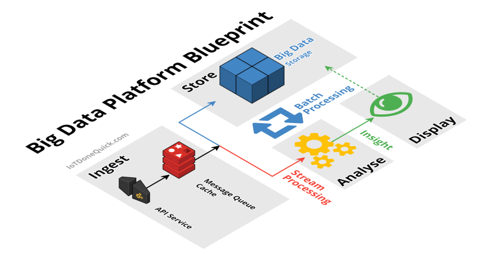
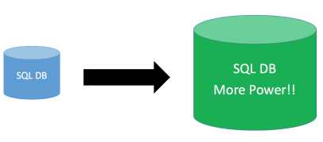
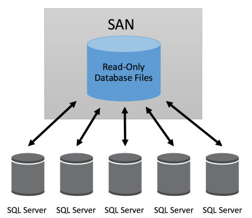
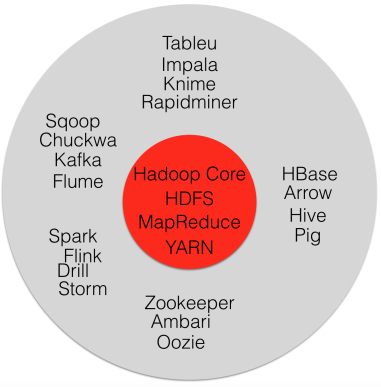
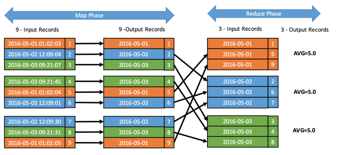

# Keep-Learning

[TOC]

## 逛 Github 的思考

* 能不能自己也做一个类似的东西
* 能不能发现项目中的问题，提交一些 bug
* 能不能

## 技术名词

### Shadowsocks

[Shadowsocks 笔记](https://github.com/JadaGates/ShadowsocksBio)

SS 最先发布在 V2EX 社区，作者是 clowwindy。

Shadowsocks 不同于 VPN，SS 的一大特点是网络分流技术（部分代理），配置文件中的网站走代理通道，配置文件之外的地址全部走直连通道。

Shadowsocks 原理和 VPN 类似，其同样受限于服务器。

### UML Sequence Diagram

* **什么是 UML 时序图？**

* **UML 时序图绘制教程**
  * [UML Sequence Diagram Tutorial](https://www.lucidchart.com/pages/uml-sequence-diagram#top)
  * [What is Sequence Diagram?](https://www.visual-paradigm.com/guide/uml-unified-modeling-language/what-is-sequence-diagram/)
  * [Unified Modeling Language (UML) | Sequence Diagrams](https://www.geeksforgeeks.org/unified-modeling-language-uml-sequence-diagrams/)
* **绘制 UML 时序图的工具**
  * 所见即所得
    * ProcessOn
    * draw.io (更好)
  * 代码生成
    * [plantuml](http://plantuml.com/zh/) 
    * [zenuml](https://app.zenuml.com/) 
* **绘图注意事项**
  * 一个 Activation box 就是一个任务，box 越长，代表任务越长，发起的请求应该指向 box 的头部，create 除外

### VPN

VPN 就是在国外的一台机器上搭建了一个服务端，然后用国内的客户端进行连接，建立特殊的通道（VPN），将上网的所有流量，通过国外的机器打出去。

### HTTPs

HTTPS == HTTP Secure == Secured HTTP

### MongoDB 

MongoDB is a general purpose, **document-based**, **distributed** database built for **modern application** developers and for the **cloud era**. 

MongoDB 和 MySQL 最大的不同：stores data in JSON-like document other than the traditional row/column model. MongoDB 存储的数据结构为 JSON，而传统的存储则是按照表进行存储。MongoDB 适用于 Node.js 项目。

### docx 和 xlsx 文档

docx 和 xlsx 文档实际上是一个压缩包，可以用解压软件打开，压缩包内有大量的 xml 文件，实际上 docx 格式的文档是一种**标记语言文档**，其和 markdown / HTML 没有本质的区别。

注意：doc 和 xlsx 文档并不是一种标记语言文档，其压缩包内的文件并不是纯文本。

### 秒/毫秒/微秒/纳秒

| 单位   | 换算          | English      |
| ------ | ------------- | ------------ |
| 1 毫秒 | $1s = 10^3ms$ | millisecond  |
| 1 微秒 | $1s = 10^6μs$ | microseconds |
| 1 纳秒 | $1s = 10^9ns$ | nanosecond   |

### 101 

Demo: [Streaming 101](<https://www.oreilly.com/ideas/the-world-beyond-batch-streaming-101>)，[火箭少女 101](<https://baike.baidu.com/item/%E7%81%AB%E7%AE%AD%E5%B0%91%E5%A5%B3101/22681022?fr=aladdin>)

101 代表一个领域的 Introduction。

### 华为鸿蒙

关键词：微内核 / 分布式 / 开源  / 可扩展性(兼容性好)

不管技术上实现难度如何，华为此举是非常具有战略性意义的，鸿蒙是一款面向云计算 / 物联网 / 5G 的下一代操作系统，是一款划时代的，面向未来的操作系统。

我们究竟需要什么样的操作系统？

* 对于用户来说，我们希望我们的各种设备：电脑 / 手机 / 平板 / 可穿戴设备 / 智能家居嵌入式设备，都能获得良好的一致性体验
* 对于开发者来说，我们希望我们的代码能够一端开发，多端运行

当我了解到鸿蒙操作系统的特性时，我联想到了 VSCode，鸿蒙有些特点和 VSCode 非常相似：

|          | 鸿蒙                                         | VSCode                       |
| -------- | -------------------------------------------- | ---------------------------- |
| 可扩展性 | 面向物联网，兼容各种设备，一次开发，多端运行 | Extensions for each language |
| 内核     | 精简的微内核                                 | VSCode vs VS                 |
| 是否开源 | 开源                                         | open source                  |

云计算 / 物联网 / 5G 这些变革，早晚会催生出一款大一统的操作系统，华为抓住了这一机遇，所以说鸿蒙是非常具有战略意义的。如果说，VSCode 是 IDE 的未来，那么我觉得鸿蒙可能是操作系统的未来，或者说，面向云计算 / 物联网 / 5G 的操作系统，是操作系统的未来。

### Restful API

**Representational State Transfer** ([**REST**](https://en.wikipedia.org/wiki/Representational_state_transfer)) is a [software architectural](https://en.wikipedia.org/wiki/Software_architecture) style that defines a set of constraints to be used for creating [Web services](https://en.wikipedia.org/wiki/Web_service).

REST 是一套用于构建 Web Service 的规范。

###开源许可证

常用的开源许可证有两个：

1. 允许做任何事情，包括闭源：MIT

   The [MIT License](https://choosealicense.com/licenses/mit/) is short and to the point. It lets people do almost anything they want with your project, including to make and distribute closed source versions. 

2. 要求使用后开源：GUN GPLv3

   The [GNU GPLv3](https://choosealicense.com/licenses/gpl-3.0/) also lets people do almost anything they want with your project, *except* to distribute closed source versions. 

### 持续集成 / 持续交付 / 持续部署 / 上线流程

[持续集成是什么](http://www.ruanyifeng.com/blog/2015/09/continuous-integration.html)

[利用 Webhooks 实现代码的自动拉取](https://blog.csdn.net/mrzhouxiaofei/article/details/84191517)

* **持续集成(Continuous Integration CI)**：持续频繁的将代码集成到主干（集成到主干之前，必须经过自动化测试）
  * 目的：快速高质量的迭代产品
  * 优点：快速发现问题，防止分支大幅度偏离主干
  * 面向团队：研发
* **持续交付**：持续集成的下一步，交付给质量团队评审
  * 面向团队：测试
  * 主要工作：自动化测试
* **持续部署**：持续交付的下一个阶段，交给运维团队部署上线
  * 面向团队：运维

**一次上线的标准流程**：

研发将最新的代码提交到 Github 上，commit 配置了 hook，触发了服务端的 Jenkins，Jenkins 从 Github 同步代码进行自动化测试。

## 业务名词

### 去 IOE

I: IBM 小型机 / 大型机

O: Oracle 数据库软件

E: EMC 存储

### 分发

分发，顾名思义，就是将任务分配给他人发送。例如我开发了一个 app，然后为了更多的人能够下载，将该 app 上架到各大 APP 商店（分发渠道）。

### 2B，2C

**B2B**：Business 2 Business 商家对商家，例如阿里巴巴

**B2C**：Business 2 Consumer 商家对个人，例如京东自营

**C2C**：Consumer 2 Consumer 个人对个人，例如淘宝

**O2O**：Online 2 Offline 线上对线下，例如美团团购，淘票票，偏向于线下消费

### OKR

Objective Key Result

我的理解：OKR = O + KPI，OKR 给 KPI 加了一个更高层次的使命感和意义。

## Data Engineering Cookbook

[Data Engineering Cookbook](<https://github.com/andkret/Cookbook>) 可以充当一本口袋书。

### 大数据三驾马车

**计算机的核心：计算资源和存储资源（冯诺依曼架构：计算/存储/输入输出）。任何一个系统都离不开这两个部分。大数据就是分布式的计算和存储。**

* **分布式计算**：MapReduce
* **分布式存储**：HDFS(分布式文件系统), HBase(分布式数据库)

### 平台蓝图

* 消息队列工具：Apache Kafka, RabbitMQ or AWS Kinesis
* 数据分析平台：MapReduce or AWS Elastic MapReduce to Apache Spark and AWS lambda
* 数据存储：Hadoop HDFS, Hbase, Amazon S3 or DynamoDB
* 数据可视化：eCharts, D3, Baidu Sugar

### 业务量剧增的解决方法

可以联想到分级平台压力增大后的解决方法，其优化的方向无非是 Scaling up 和 Scaling out：

**Scaling up: 申请性能更强的机器**

**Scaling out: 申请两台机器进行负载均衡**

|                 | Description          | Demo                                                         |
| --------------- | -------------------- | ------------------------------------------------------------ |
| **Scaling up**  | 提升目前服务器的性能 | 申请一台更强的机器  |
| **Scaling out** | 将压力均匀的分配出去 | 分布式计算/分布式存储，多台机器进行负载均衡 |

### 什么时候考虑用大数据技术来解决问题

需要 Scaling 的时候，才考虑使用大数据技术来解决问题。

当平台性能掣肘之时，或者我们需要针对某一个模块进行优化的时候，就可以考虑从 scaling up 和 scaling out 两个方向来引入大数据的技术来解决问题。例如对实时性要求高，就可以考虑用缓存或者 Kafka 来暂存数据；数据量太大，可以考虑用 HDFS 来进行分布式存储。

### Batch Processing vs Streaming Processing

|                          | Description                                                  | Feature          |
| ------------------------ | ------------------------------------------------------------ | ---------------- |
| **Batch Processing**     | 先存储再分析    | 懒汉式           |
| **Streaming Processing** | 在存储前会有分析 | 饿汉式，实时性强 |

### Hadoop 和 Hadoop 生态

一个分布式存储和计算平台。

**Hadoop 流行的原因**：Adoption to many Apache projects. —> Turn into an ecosystem. Hadoop 有丰富的**周边产品**，并且已经形成了生态。

You use Apache Kafka to ingest data, and store the it in HBase. 

* **Zookeeper**：ZooKeeper is a centralized service for maintaining configuration information, naming, providing distributed synchronization, and providing group services. 
* **Kafka**：Data cache and Message Queue
* **YARN**：resource management 
* **Zookeeper **：configuration management service to use Kafka and HBase 
* **HDFS**：Hadoop File System
* **HBase**：Hadoop Database

**Hadoop 生态的缺点**

Hadoop 生态部署后非常耗费资源（尤其在单台机器上），我们至少需要 5台机器去部署一个 Hadoop 集群，否则无法发挥 Hadoop 的威力。所以**我们应该了解这个生态的每一个模块，当我们需要某个功能时，能联想到 Hadoop 的某个模块，然后拿来用即可。**

**Hadoop 生态的核心工具**

Yarn Zookeeper HDFS Oozie Flume Hive 

### MapReduce

Map 和 Reduce 这两个阶段都可以实现分布式并行计算。

Demo:

1. the map stage could be done by nine mappers in parallel because each map is independent
   from all the others.
2. The reduce stage could still be done by three tasks in parallel.

### Spark

**Spark 和 Hadoop 的关系**

Hadoop 是一个生态，包括分布式计算和存储，而 Spark 只是一个计算平台，没有存储能力，Spark 属于 Hadoop 生态。

### Database

* **InfluxDB**：Time Series Database 

### Machine Learning in Big Data

**目前比较棘手的问题**：Automatic re-training and re-deploying. （自动化模型迭代和上线）

