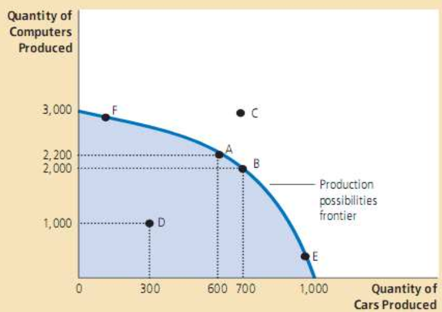
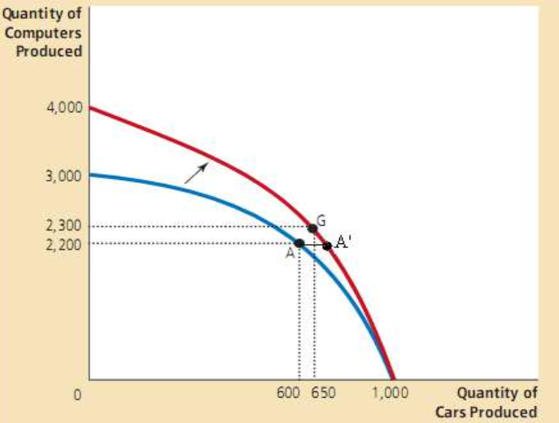
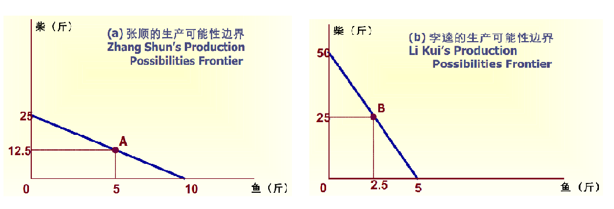

# 经济学原理

[TOC]

## 授课老师 / 经典著作

* 清华大学经管学院院长：钱颖一，02 年来到经管学院
* 经管学院副院长、党委副书记：钟笑寒
* 亚当斯密-《国富论》
* 大卫李嘉图-《政治经济学与赋税原理》

## 1. 什么是经济学

* 经济学界的诺贝尔奖：**克拉克奖章**
* 经济学，是一门研究**选择**的**社会科学**。
* **经济学三类问题，十大原理**
  * 人们怎么做决策（微观经济学）
    * 人们面临得失交换（**权衡取舍**） People face **tradeoff**.
    * 某物的成本是为此所放弃的东西（**机会成本**） The **cost** of something is what you give up to get it. 
    * 理性人思考边际量（**边际成本**） Rational people think at the **margin**.
    * 人们会对激励做出反应（**激励**） People respond to **incentives**.
  * 人们如何相互作用（微观经济学）
    * 贸易能使人人受益（**交换**） **Trade** can make everyone better off.
    * 市场通常是组织经济活动的好方式（**市场**） **Markets** are usually a good way to organize economic activity.
    * 政府有时候可以改进市场结果（**政府**） **Governments** can sometimes improve market outcomes.
  * 整体经济如何运行（宏观经济学）
    * 一国的生活水平取决于它的生产（**生产力**） The standard of living depends on a country's **production**.
    * 当政府发行了过多的货币时，物价上涨（**货币**） Prices rise when the government prints too much **money**. 
    * 社会面临通货膨胀和失业之间的短期得失交换（**通胀与失业**） Society faces a short-run tradeoff between **inflation** and **unemployment**. 

### 权衡取舍 tradeoff

天下没有免费的午餐，有得就有失。时间成本。

### 机会成本 opportunity cost

**机会成本**是指在面临多方案择一决策时，被舍弃的选项中的最高价值者是本次决策的**机会成本**。 简单来说，某物的机会成本是为了得到它而放弃的东西。

每当我们做了一个选择，我们就放弃了其他的选择。

权衡利弊得失，时间成本，选择了国企，那么我的机会成本是什么？如果选择另一个方案，会不会有更好的收益？比尔盖茨为什么退学？是因为上学的机会成本太高了。民工荒：打工的机会成本变高。

我为了考上研，放弃了太多的东西。

### 边际成本 marginal cost

边际成本是对已有行动计划的小的、增量微调。

动态的思维，谁都要吃饭的，边际成本是多吃一口，少吃一口的问题。航空公司在乘客上完之后，允许员工的家属免费搭乘飞机。

李老师所作的那些“施舍”和虚伪的“关心”，实际上都是成本很低的边际成本。

###激励机制 incentive

激励机制无处不在：消费券，奖学金，拼多多拼团优惠等。还有例如安全带激励司机开车不注意安全，使得受伤的行人增多；保险机制可能带来更多的风险，增加杠杆。

### 交换可以使得人人受益

交换也可以理解成交易，交流。交易可以使得人人受益；在交易中竞争也可以得到受益；交易可以促进人们的专业分工。

### 市场经济 market economic

看不见的手（invisible hand），**价格**，使得企业自己决定雇佣谁和生产什么，人们自己决定买什么和为谁工作。

###政府的作用

罗斯福新政，金融危机。促进公平，税收，福利，医疗。

### 通货膨胀 inflation

**整体**物价水平的上升。注意，是**整体**！猪肉价格，水果价格上涨，都不是通货膨胀。长期的通货膨胀，大概率是货币货币导致的。

通货膨胀和失业率，政府向市场注入大量现金 ——> 人们手里有了更多的钱开始**消费** ——> 企业招聘更多的工人生产 ——>  失业率下降。（**四万亿的作用**） 

## 编外：经济学概念

### 基准利率

基准利率就是一个市场上利率水平的风向标。各个金融机构，都根据这个标准来确定自己的贷款和存款利率。央行提高或者降低基准利率，就意味着提高或者降低整个社会的利率水平。

美国在疫情期间的基准利率已经降到了 0%。

利率是资金的成本。利率低就说明资金便宜，你可以用非常低的价格借到钱。反过来，它也反映了社会的平均利润率。如果各种项目的利润率很高，而利率又很低，就会有更多的人去借钱，从而促使利率回升。

**利率一降再降，恰恰说明了社会的平均利润率在不断下降。** 通俗地说，就是可以赚钱的好项目，越来越难找了。

下面就是这件事对每个人的影响： **高回报项目的消失、利率的下降、经济增长的放缓，使得你很难有办法攒钱了。** 你好不容易积攒了一点工资，却发现根本找不到高回报的投资途径，不管是银行存款、证券投资、项目投资，回报率都很低。

## 2. 像经济学家一样思考

* 经济学是一门**社会科学**，也是一门**经验科学**，有一套科学的研究方法，**观察**，获取数据，提出理论，验证
* 经济学的难点：很难获取数据，很难实证，例如 90 年代**经济特区**的实验，通常是做一个**小样测试**，或者做出**假设**，我的研究生毕业论文，就是假设一条微博的情感只有正负，**假设越少越好，越简单越好，越抽象简单的理论，其解释的范围越广**，便于理解。
* 冷门的、**general** 的问题，更值得去探索，**不要盲目跟风**
* 学会三种表达方式：**说话、图形和数学**，这不止是经济学的表达方式，任何严谨的表达都应该如此
* **生产要素**：**土地、劳动力和资本**

### 生产可能性边界 / 边际收益递减 diminishing marginal returns 

The Production Possibilities Frontier

生产可能性边界，表示的是经济能够生产出的产品组合。

**假设**，假设一个公司只生产汽车和电脑，并且只有有限的生产要素。（**一个简单的假设**）

那么该公司的生产组合只能是**边界**（边界效率最高）或者边界内部的组合。**汽车和电脑互为彼此的机会成本**。如果公司想要多生产几辆汽车，就要少生产几台电脑。关键在于，如果调配生产组合，形成生产利益的最大化。

假设所有的生产资源都用来生产汽车，那么最多能生产 1000 量汽车，但是这并不一定能**最大化地利用资源**，此处曲线的斜率越大，x 轴汽车生产数量的一点减少，能够带来 y 轴电脑生产数量的快速增长。这就是**边际效益递减**。同样的道理，一门科目，在及格线处想要提高一分很容易，但是如果 90 分再多考一份，就可能需要耗费比 60 分多得多的精力，这也是边际效益递减。考研也是如此，我们的精力是有限的，面对那么多的科目需要复习，没有必要在单科上追求完美，而是应该**追求总分的最大化**。

当制造电脑的**技术进步**后，曲线变成了：

我们可以看到，在制造电脑的数量不变的情况下，电脑的技术进步使得汽车的制造数量增加了。这也很好解释，制造电脑的技术在引入流水线后，原来需要 10 个人在生产线，现在可能只需要 5 个人就可以操作整个生产线，剩下的五个人则可以去制造汽车，从而使得汽车的制造数量增加，所以汽车和电脑的价格是**相互影响**的。同样的现象可以解释理发行业的价格，理发的技术进步较慢，但是其他行业的技术进步较快，从事理发的机会成本就变得越高，所以理发的价格也随之增加。

### 经济模型中的因果关系

最简单的因果关系：$y=f(x)$

x：**外生变量**，因，输入

y：**内生变量**，果，输出

被忽视的变量：x 增长，y 也增长，可能都是由 z 导致的。例如，打火机和癌症，都是由吸烟引起的。

反向因果关系：夫妇购买旅行车先于小孩的出生，小孩才是因。

**计量经济学的精髓：从一堆数据中，寻找因果关系。**

### 经济分析方法

#### 考虑个人行为时

**稀缺性 Scarcity ——> 机会成本 Opportunity cost ——> 得失交换 Tradeoff**

例如，价格上升引起需求下降，价格上升，稀缺性变高，机会成本就上升

#### 考虑多人决策相互作用时

均衡 ——> 效率？——> 双赢。最大熵算法。

#### 应用于其他学科

**出发点**：资源的**稀缺性**和**人的行为**动机的**自利性**

**着眼点**：经济人相互作用的**效率**结果

**政府中的经济学家**

中国：党中央-中央财经领导小组办公室，各部委，国务院政策研究室，国务院发展研究中心，中国社科院

美国：国家经济事务顾问，总统经济顾问委员会，美联储

## 3. 经济的相互依存性和贸易的好处

### 为什么要进行交易

**经济学源于生活。**

**为什么要进行交易**？一个具体的例子：张顺和李逵

李逵擅长砍柴，张顺擅长捕鱼，以前两个人都是半天捕鱼，半天砍柴，自给自足，每天张顺获得 5 斤鱼，12.5 斤柴，李逵获得 2.5 斤鱼，25 斤柴。

后来两人合作，一人负责打鱼，一人负责砍柴，然后分别拿半天的收益相互交换：

最后每个人获取到的结果是：张顺获得的鱼没变，柴翻倍，李逵获得的柴没变，鱼翻倍。两个人都过上了更幸福的生活。

**每个人都生产自己最擅长的产品，然后进行交易，就会共赢。**

**人与人交往也是如此，多和人交流，多交易，才能共赢。**

### 比较优势与绝对优势

如何从理论上解释这种现象？

**为了增加总产量，应该让生产该商品机会成本更小的生产者来更多地生产它。专业地人干专业的事。那么经济的总产量就增加了**。

**比较优势原理**（机会成本）：每个人各自生产他们具有**比较优势**的产品、然后进行交易，那么 他们的情况都会变好。

度量生产成本差异有两种方法：

1. **比较优势**：为了一种产品而放弃另一种产品的**机会成本**
2. **绝对优势**：生产单位产品所需要的时间成本（错误的度量方法）

绝对优势错在哪里？

李逵一天的产量不管是鱼还是柴的单位时间成本都比李鬼高，但是按照机会成本来算的话，其打鱼的机会成本太高了，还不如向李鬼买鱼划算。相同的例子：

* **教授**打字打得既快又好，但是其打字的机会成本就高于他的秘书
* **老虎伍兹**打高尔夫球打得很好，修剪草坪也修得很好，但是不如交给邻居家的小孩干
* 大学的目的就是发现自己的比较优势

所以，**比较优势决定了贸易和分工。样样比别人强，样样自己干，从经济学上讲，并不一定是正确的。**

## 4. 供给与需求

供给与需求是经济学家最常用的两个术语。

买方决定需求；卖方决定供给；买方和卖方共同决定市场结果。

### 需求-消费者

**需求定律**：其他条件不变，价格上升导致需求量下降。

**消费者收入**：收入增加，对**正常商品**的需求量会增加，对**劣质品**的需求量会减少。

**替代品和互补品**：新冠肺炎 ——> 医用口罩需求上升，其互补品的需求都会上升，例如普通口罩，消毒酒精，**裹尸袋**等，用联系的思想看问题。

### 供给-生产者

**供给定律**：其他条件不变，价格上升导致供给量增加。（什么赚钱种什么，卖家都是趋利的，也是盲目的）

### 市场类型

* **竞争市场**

  有**众多**买者和卖者的市场是竞争市场，价格空间比较小，很难操作；价格作为外生变量，不是个人所能操控的，买家和卖家都是**价格接收者 price taker**。

  需求量是买者愿意而且能够购买的商品数量。

* **市场类型：垄断**

  Monopoly

  只有**一个**卖者，卖家是价格操控者。

* **市场类型：寡头**

  Oligopoly

  只有**少数几个**卖者。百事可乐与可口可乐；石油出口国。

