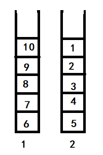

# Chapter3. List Stack Queue

[TOC]

## 线性表和非线性表

**线性表**：顺序表/链表/栈/队列

**非线性表**：二叉树/图

线性表和非线性表的划分，是根据其逻辑来划分的，而不是根据其存储结构来划分的。每个线性表上的数据最多只有前后两个方向。

## List

### List 的分类

* ArrayList: 顺序表
* LinkList: 链表

### 顺序表和链表的区别

**最本质的区别**：顺序表在内存是**连续存储**的，而链表在内存中是**离散存储**的。

顺序表：**连续存储** —> **索引**，顺序表要根据索引进行查找

链表：**离散存储** —> **指针**，链表要根据指针进行查找

其他所有的区别，都源于这个最本质的区别，由于顺序表是连续存储的，所以可以根据**索引**进行快速查找，但是如果想要插入和删除，为了保持顺序表的连续性，部分元素就需要移位，而这正是链表所擅长的，链表的离散存储特性决定了其无法快速的查找，但是可以快速的进行插入/删除操作。

链表由于其需要另外开辟空间存储下一个节点的指针，所以其比顺序表要耗费更多的内存。并且由于链表的空间是离散分配的，在内存回收后，会产生更多的内存碎片，不方便利用。

线性表的使用场景更多一些，其相较于链表，更节省内存，而且可以借助 CPU 的缓存机制，加速线性表的访问速度。但是其缺点也很明显，其需要占用连续的存储空间，一旦申请的空间很大，就会导致申请失败；另外，如果申请的空间不够用，那么就得向操作系统申请一个更大的连续空间，然后将顺序表中的内容 copy 过去，而 copy 的操作是非常耗时的。

### 链表指针和引用的区别：递归删除链表中值为 x 的节点

## Stack

### 链式栈

链式栈的优点：不存在栈满上溢的情况。

### 用栈实现队列

两个栈实现队列：

队列的四个基本操作：

* 入队

  入栈 1，栈 1 满后，如果栈 2 为空，则栈 1 内元素全部入栈 2，如果栈 2 不为空，则队满

* 出队

  栈 2 出队，如果栈 2 为空，则栈 1 元素全部入栈 2，如果栈 1 也为空，则队列为空

* 判断队列是否为空

  如果栈 1 和栈 2 都为空，则队列为空

用两个栈实现队列，代码实现：

### 后缀表达式

### 汉诺塔问题(hannoi)

