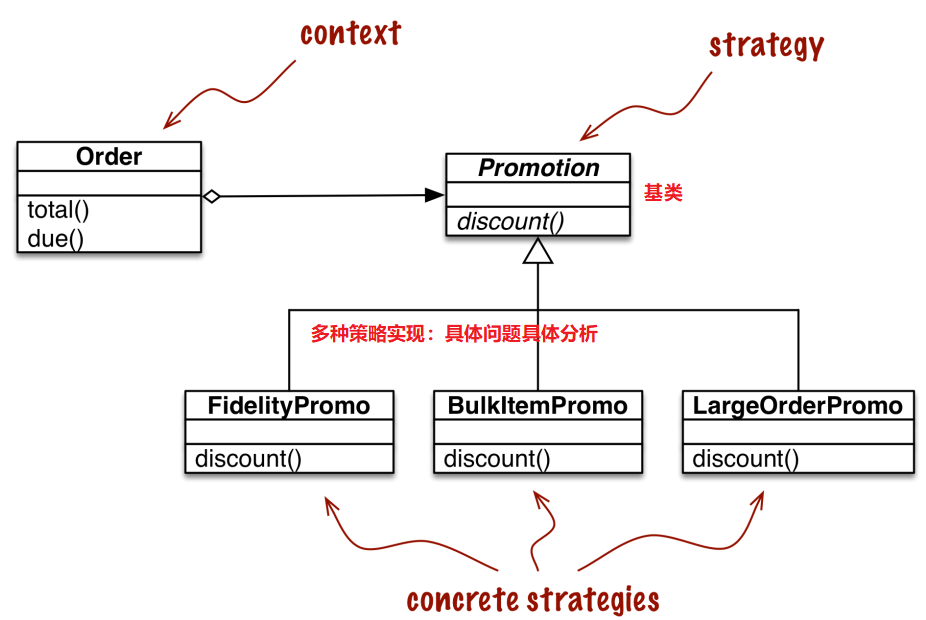

# Chapter6. Design Patterns with First-Class Functions

[TOC]

当我们引入了 **函数作为第一公民** 的概念后，Peter Norvig 建议我们重新思考的几个设计模式为：

| English                           | Chinese      |
| --------------------------------- | ------------ |
| Strategy Pattern (policy pattern) | 策略模式     |
| Command Pattern                   | 命令模式     |
| Template Method Pattern           | 模板方法模式 |
| Visitor Pattern                   | 访问者模式   |

在以上四种设计模式中，function 可以被用来替代某些类的实例。

## Design Patterns


## Classic Strategy Pattern

### Introduction 




当一个事情有多种方案时，例如超市的折扣针对不同的 Context，有不同的打折方案，那么就可以联想到 Strategy Pattern。Strategy Pattern 的本质是**具体问题具体分析**。

### Classic Implement

经典的 Strategy Pattern 实现。从这个示例代码中，我们可以学到很多知识。

```Python
# -*- coding: utf-8 -*-

from collections import namedtuple
from abc import ABC, abstractmethod

Customer = namedtuple("Customer", "name fidelity") # 没有成员方法，可以直接用 namedtuple 来包装


class LineItem:
    """商品"""
    def __init__(self, product, quantity, price):
        self.product = product
        self.quantity = quantity
        self.price = price

    def total(self):
        return self.price * self.quantity


class Order: # the Context
    """订单"""
    def __init__(self, customer, cart, promotion=None): # promotion 是可选参数，默认为 None
        self.customer = customer
        self.cart = cart
        self.promotion = promotion

    def total(self):
        """计算商品总额"""
        if not hasattr(self, "__total"): # 判断是否有该属性，防止重复计算
            self.__total = sum(item.total() for item in self.cart)
        return self.__total

    def due(self):
        """应付额"""
        if self.promotion is None:
            discount = 0
        else:
            discount = self.promotion.discount(self) # 将当前类的对象传入
        return self.__total - discount

    def __repr__(self): # print(order)
        return "<Order tota:{:.2f} due:{:.2f}>".format(self.total(), self.due())


class Promotion(ABC): # The Strategy: an abstract base class，抽象基类
    """促销基类，定下契约"""
    @abstractmethod
    def discount(self, order):
        """折扣"""
        pass


class FidelityPromotion(Promotion): # concrete strategy
    """5% discount for customers with 1000 or more fidelity points"""

    def discount(self, order):
        return 0 if order.customer.fidelity < 1000 else order.total() * .05


class BulkItemPromotion(Promotion): # concrate strategy
    """10% discount for each LineItem with 20 or more units"""

    def discount(self, order):
        discount = 0
        for item in order.cart:
            if item.quantity >= 20:
                discount += item.total() * .1 # Python 的小数可以不写 0
        return discount


class LargeOrderPromotion(Promotion): # concrate strategy
    """7% discount for orders with 10 or more distinct items"""

    def discount(self, order):
        discount = 0
        distinct_items = {item.product for item in order.cart}
        if len(distinct_items) >= 10:
            discount = order.total() * .07
        return discount


if __name__ == "__main__":

    joe = Customer("John Doe", 0)
    ann = Customer("Ann Smith", 1100)
    cart = [
        LineItem("banana", 4, .5),
        LineItem("apple", 10, 1.5),
        LineItem("orange", 5, 5.0)
    ]
    order1 = Order(ann, cart, promotion=FidelityPromotion()) # 传入一个策略：类的实例
    print(order1)  # <Order tota:42.00 due:39.90>

```

### Function-Oriented Strategy

**重构原理**

因为 first-class object 的特性，function 可以和对象一样进行赋值。在很多时候，我们为了调用某个方法，需要实例化包装该方法的类，这是不必要的，有了 first-class function 后，我们不需要将功能性的方法包装在类中再调用，而是可以直接将 function 作为参数传入，A function is more light-weight than an instance of user-defined class。当我们需要实现某个接口的唯一方法时，我们可以用 function 来取代该 Class。

实际上，应用 Frist-class function 这一特性，function 可以重构很多设计模式在 Python 中的实现。Peter Norvig 说过，23 个设计模式中，有 16 个设计模式可以在动态语言中被重构，甚至已经被设计到了编程语言中。


Function-Oriented Strategy Pattern 实现。

```Python
# -*- coding: utf-8 -*-

from collections import namedtuple
from operator import itemgetter

Customer = namedtuple("Customer", "name fidelity")


class LineItem:
    """商品"""
    def __init__(self, product, quantity, price):
        self.product = product
        self.quantity = quantity
        self.price = price

    def total(self):
        return self.price * self.quantity


class Order: # the Context
    """订单"""
    def __init__(self, customer, cart, promotion=None): # promotion 是可选参数，默认为 None
        self.customer = customer
        self.cart = cart
        self.promotion = promotion

    def total(self):
        """计算商品总额"""
        if not hasattr(self, "__total"): # 判断是否有该属性，防止重复计算
            self.__total = sum(item.total() for item in self.cart)
        return self.__total

    def due(self):
        """应付额"""
        if self.promotion is None:
            discount = 0
        else:
            discount = self.promotion(self)
        return self.total() - discount

    def __repr__(self):
        return "<Order tota:{:.2f} due:{:.2f}>".format(self.total(), self.due())


def fidelity_promotion(order): # concrete strategy
    """5% discount for customers with 1000 or more fidelity points"""
    return 0 if order.customer.fidelity < 1000 else order.total() * .05


def bulk_item_promotion(order): # concrate strategy
    """10% discount for each LineItem with 20 or more units"""
    discount = 0
    for item in order.cart:
        if item.quantity >= 20:
            discount += item.total() * .1
    return discount


def large_order_promotion(order): # concrate strategy
    """7% discount for orders with 10 or more distinct items"""
    discount = 0
    distinct_items = {item.product for item in order.cart}
    if len(distinct_items) >= 10:
        discount = order.total() * .07
    return discount


def get_best_promotion(order, promotions):
    """获取最大的 promotion"""
    promotion2discount = [(promotion, promotion(order)) for promotion in promotions]
    sorted_promotion2discount = sorted(promotion2discount, key=itemgetter(1))
    return sorted_promotion2discount[-1][0]


if __name__ == "__main__":

    joe = Customer("John Doe", 0)
    ann = Customer("Ann Smith", 1100)
    cart = [
        LineItem("banana", 4, .5),
        LineItem("apple", 40, 1.5),
        LineItem("orange", 5, 5.0),
    ]

    existed_promotions = [globals()[name] for name in globals()
                  if name.endswith("_promotion") and not name.endswith("best_promotion")] # 获取所有策略
    order1 = Order(ann, cart)
    order1.promotion = get_best_promotion(order1, existed_promotions)
    print(order1.total())
    print(order1.due())  # <Order tota:42.00 due:39.90>

```


## Further Reading

* [Design-Patterns](<http://norvig.com/design-patterns/>)

* [ABC: Python Abstract Base Class](<https://docs.python.org/3/library/abc.html>)

* [Learning Python Design Patterns](ftp://ftp.rasla.ru/Books/_IT_/Python/Gennadiy_Zlobin_-_Learning_Python_Design_Patter.pdf)

* [Design Patterns in Dynamic Languages](<http://norvig.com/design-patterns/>)

* [Teach Yourself Programming in Ten Years](<http://norvig.com/21-days.html>)

  

  