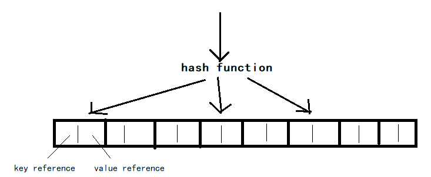

# Chapter3. Dictionaries and Sets

[TOC]

## Mapping Types 的特征

所有的 mapping types 的底层，都是 `dict`，他们的 key 必须是可以 hashable 的。

```python
ss = "hello"
hash(ss)
```

在使用 mapping types 的时候，应该始终考虑内存的效率问题。Dict 是设计被用来高效查找的，其并不适合存储，在存储的时候，考虑用 namedtuple 来代替！

## hash table 的原理

hash table 本质上是一个稀疏的顺序表，每一个表中的单元叫做**桶**，每一个桶中包含有两个引用：reference to the key and reference to the value, 我们通过哈希函数 hash(key) 将 key 和 value 映射到桶里。



Python 会保证顺序表中，**至少有 1/3 的空桶**，如果 hash table 变得拥挤，那么 Python 会将开启一块更大的空间，然后将原来的 hash table copy 过去。

## hashable built-in types

可以 hash 的内置类型有：

* atomic immutable types: \(str, bytes, numeric types\)
* tuple only if all its items are hashable
* user-defined types
* 如果一个对象实现了 `__eq__()` 方法，那么只有类的内部属性都是私有的，才能 hashable

Demo:

```Python
class Demo:

    def __init__(self, name, age):
        self.name = name
        self.age = age

    def __eq__(self, other):
        return self.names == other


demo = Demo("wansho", 25)
print(hash(demo))

"""
Traceback (most recent call last):
  File "D:/Github-Code/test/hashable.py", line 13, in <module>
    print(hash(demo))
TypeError: unhashable type: 'Demo'
"""
```


注意，并不是所有的 immutable types 都是 hashable 的，如果一个 tuple 中有 mutable 的对象，那么这个 tuple 就是不可 hash 的。

用户自定义的类型，都是可以 hash 的，因为其每个对象都是独一无二的，其 hash 值就是其 id，

### why list unhashable

list 的内容会变动，而 hash 要求 key 不变。

## build a dict

### 常见构造方法

```python
my_dict = {"name": "wansho", "age": 25} # 最常见的构建方法

# 用 dict() 方法构建
my_dict = dict(name="wansho", age=25)
my_dict = dict(zip(["name", "age"], ["wansho", 25]))
my_dict = dict([("name", "wansho"), ("age", 25)])
my_dict = dict({"name": "wansho", "age": 25})

# values 不确定的情况下，根据 keys 值创建一个 dict
dt = dict.fromkeys([1,2,3], defalut_value)
# {1: defalut_value, 2: defalut_vlue, 3: defalut_value}
```

### dict comprehensions 字典推导式

```python
my_dict = {key: value for key, value in lst}
```

## dict 常见方法

```python
my_dict = {"name": "wansho", "age": 25} 
my_dict.keys()
my_dict.values()

my_dict.items() # 将 keys 和 values 组合在一起
my_dict.clear()

my_dict.pop(key) # 删除一对数据并返回
my_dict.popitem() # 随机删除一对元素并返回
```

### update\(\) 方法详解

update 方法是鸭子模型的典型体现。

其可以接收拥有 mapping 或 iterating 的对象。首先判断接收的对象是否有 `keys()` 方法，如果有，则把它当成一只鸭子\(mapping\)，否则再尝试 iterate 该对象，如果可以 iterate，那么就假定该对象中的元素为 元组对\(key, value\)。

update\(\) 接受的对象，可以是如下几种：

1. mapping types
2. iterated types with \(key, value\) tuple items
3. keyword arguments

### handle missing keys with setdefault\(\) / defaultdict

Python 有四种通过 key 获取值的方式：

```python
# 第一种
my_dict["students"]
# 第二种
my_dict.get("students", [])
# 第三种
my_dict.setdefault("students", [])

# 第四种
import collections
my_dcit = collections.defaultdict(list) # 默认缺失值为 list，list 为 default_factory
my_dict["students"].append("wansho")
```

其中，第二种和第三种都有处理 missing key 的方式，第二种方式常见的代码逻辑为：

```python
student_list = my_dict.get("students", []) # 第一次搜索
student_list.append("wansho")
my_dict["students"] = student_list # 插入数据，实际上是第二次搜索
```

实际上，第二种方式进行了两次搜索，我们再来看一下第三种方式：

```python
my_dict.setdefault("students", []).append("wansho")
# setdefault 方法先按照 key 进行搜索 value，如果 key 不存在，则就地插入 (key, default_value)并返回 default_value 的引用，这样就避免了插入时的第二次搜索。
```

第四种方式的效率和第三种一样，不同的是其采用了 `collections.defalutdict` 来处理缺失值，下面拆解一下插入语句：

```python
my_dict["students"].append("wansho")
# 1. 执行一遍搜索，发现 students 是 missing key
# 2. 按照默认的缺失值类型，生成一个 list，并将 (key, default_value) 就地插入到 my_dict 中，然后返回 default_value 的引用
# 3. default_value 加入新的数据
```

## dict 的变体

注意，这些 dict 的变体，都拥有 dict 的基础特性，也就是说，可以使用 dict 的 built-in 方法。

### collections.OrderedDict

有序字典，使得在遍历 Dict 时，输出顺序为元素的插入顺序。

```python
import collections
ordered_dict = collections.OrderedDict([("name", "wansho"), ("age", 25)])
print(ordered_dict) # OrderedDict([('name', 'wansho'), ('age', 25)])
```

### collections.Counter

Counter 通常用来对字符串中的字符进行计数，Demo:

```python
import collections
counter_dict = collections.Counter("aaaaabbbbcccdde")
print(counter_dict) # Counter({'a': 5, 'b': 4, 'c': 3, 'd': 2, 'e': 1})
counter_dict.update("aaabb")
print(counter_dict.most_common(2)) # [('a', 8), ('b', 6)]
```

## Set

### Set 的构造

```python
my_set = set()

my_set = {1, 2, 3} # 初始化一个有初始值的 set

# 注意，构建空的 set 只能用 set()，如果是如下的构造，实际上是生成了一个字典
my_dict = {}
```

### Set 的特性

* 元素独一无二
* 元素必须是可以 hashable
* 针对 set 优化的算术运算符：`| & -`

### Set 算数运算符优化

灵活运用 Set 的算数运算符，比写 for 循环的效率高很多，Demo:

```python
found = len(needless & haystack)

for n in needless:
    if n in haystack:
        found += 1
```

以上的两个块代码，在效果上等价，但是前者运用了算数运算符，其速度远大于 for 循环。

### Inplaced mathematical set operations

set 的算数运算符，同样也可以进行 inplace 的算数运算，从而优化

```python
set1 = set()
set2 = set()

set1 |= set2 # 就地合并 set1 和 set2 到 set1
set1 = set1 | set2 # produce a new set
```

### Set comparison operators

set 比较运算符，返回的结果是一个 bool 值，`in, <=, <, >=, >`

```python
set1 = {1,2}
set2 = {1,2,3}

set1 in set2

set1 <= set2
```

## Set / Dict 利弊

### Set 和 Dict 的区别

set 和 dict 的底层都是 hashtable，set 的 hashtable 的每个桶中，只有指向其 key 的指针，而 dict 的 hashtable 的桶中，还有指向其 value 的指针。

### 利

Set，Dict 适合 O\(1\) 复杂度的高效查找，dict / set / list 查找效率比较：set &gt; dict &gt; list

### 弊端

由于 dict 和 set 使用了 hashtable，hashtable 在内存中是是个稀疏的 array（Python 会保证 1/3 的空桶，否则会开辟一个新的空间），这会导致大量的内存空间被占用。所以，当我们要对处理大量的 record 时，最好用 tuple 或者 namedtuple 进行暂存，而不是用 dict in JSON Style。这是大多数人会忽略的一个事实：`天下没有免费的午餐，不要走捷径`。这也解释了，有时候我们从数据库中读取数据，用 dict 来暂存后，内存占用过大的问题。

