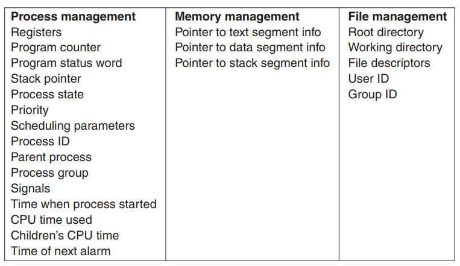

# 第二章：进程与线程

[TOC]

## 进程的重要性

进程概念的引入，使得多个任务可以在一个 CPU 上并发执行，**实现了 CPU 的虚拟化**，提高了 CPU 的利用率。

## 进程：Processes

**Pseudoparallelism  伪并行**

在一个单核的操作系统中，任何一个时刻，CPU 都只在做一件事情，CPU 通过在多个任务之前来回切换，来实现进程的并发。

注意：pseudoparallelism 和 hardware parallelism of multiprocessor systems 有本质的区别，后者是真正的在多个 CPU 上进行并行计算。

### 进程的定义: Process Model 进程模型

**进程就是运行在计算机上的任务**。所有在计算机上执行的**任务**，包括操作系统，都被看做一个进程。In process model, each has its own virtual cpu.

**Program and Process 的区别**

Program 是静态的，而 process 是动态的。进程是运行着的程序。

### 进程的创建：Process Creation

#### 操作系统中创建进程的几个场景

从创建进程的发起者角度，可以分为三个场景：

| 发起者   | short-desc                                       | desc                                                         |
| -------- | ------------------------------------------------ | ------------------------------------------------------------ |
| 操作系统 | 系统初始化创建大量进程                           | 系统在初始化的时候，会创建大量的进程，有很多都是常驻后台的守护进程 |
| 进程     | 进程发起 process-creation 的系统调用，创建子进程 | 如果一个任务可以由多个进程协作，并且高效的完成时，进程就可以通过系统调用创建多个子进程，用于工作协同，加快效率 |
| 用户     | 用户请求创建一个进程                             | 在类 Unix 系统中，用户可以通过在 shell 中输入命令，创建子进程；在 Windows 系统中，用户可以通过操作鼠标键盘，打开软件（创建进程） |

实际上，上述所有的进程创建，都是父进程通过**发起创建进程的系统调用**，由操作系统创建的子进程。区别在于，进程创建的发起者不同，是操作系统，还是正在运行的进程，还是用户。What that process does is execute a system call to create the new process.  

#### 进程的分类

1. Background Process 

   后台进程，后台进程中有一类特殊的进程，类似邮件服务/Web服务/打印服务等任务叫做  daemons  （守护进程），Linux 中通过在 cmd 后面加上 `&` 来实现后台进程，例如：`sleep 100&`

2. Foreground Process

   前台进程，与用户交互，Linux 中的 shell 就是一个前台进程，用于和用户进行交互

#### 创建进程的系统调用

* In Unix： **fork**

  在 Unix 系统中，只有唯一的一个系统调用：fork，用于创建进程

  fork 会对发起系统调用的进程，创建一个完全一样的副本（相同的内存镜像，相同的环境变量），也就是 fork 一个子进程。例如用户在 shell 中输入 sort 命令，shell 进程就会 fork 一个子进程，然后执行 sort 命令。

* In Windows: **win32 function call: CreateProcess**

  CreateProcess 用于创建进程，加载 program。该系统调用有 10 个参数。除了 CreateProcess，Windows 系统还提供了 100+ 个 function 用于管理进程。

注意：子进程一旦创建，其地址空间（address space）相对于父进程就独立了，没有任何一块可写空间是共享的。**Again, no writable memory is shared**.  这也解释了，Linux 中 子 shell 对 父 shell 变量只读的机制。

### 进程的终止：Process Termination 

#### 进程终止的两种情况

1. **自然终止**：正常终止，异常终止 exit
2. **非自然终止**：致命错误导致的终止，被其他程序终止 kill

#### 进程终止的 system call

|         | 自然终止的 system call | 被其他程序终止的 system call |
| ------- | ---------------------- | ---------------------------- |
| Unix    | exit                   | kill                         |
| Windows | ExitProcess            | TerminateProcess             |

### 进程的层次结构：Process Hierarchies 

#### Linux 进程层级

Linux 的进程都是单继承(Fork from 父进程)

Windows 没有进程层次的说法，所有的进程都是平等的。

### 进程的状态：Process States

进程的三大状态：**Running/Ready/Blocked**

### 进程的实现：Implementation of Processes 

#### Process Control Block (PCB)

进程控制块，其数据结构为 array。

注意：

* 一个进程在执行的过程中，可能会遇到上千个中断，关键在于，每次中断过后，进程能否精确恢复到中断之前的状态。（中断发生时，所有信息入栈，进入 Ready 状态，中断结束后，信息出栈，恢复 Runable 状态）
* CPU 在运行时，也就是 process 在运行时，有大量的时间是花费在了 IO 上，举例来说，交互式进程 bash 的大多数时间就是被 IO 所阻塞(等待输入)

## 线程：Threads

### 进程与线程的区别：Thread Usage

#### 从计算机角度

* 内存地址空间的差别

  进程的地址空间的相互隔离的，而线程间的地址空间是共享的，这导致了进程之间切换和通信的代价远远大于线程直接的调度和通信

* CPU 利用率的区别

  线程可以充分利用多核 CPU 进行并行计算

  CPU 对于线程调度的代价也远远小于进程，线程更加轻量，更加 Lite，易于创建和销毁。在很多系统中，线程的速度，是进程的 10—100 倍

* 输入输出设备

  输入输出设备常常伴随着大量的 IO，有 IO 就会有阻塞，线程的出现解决了进程内 IO 阻塞导致主进程无法推进的问题

#### 从程序员角度

线程的出现，使得程序员可以方便的对很多不同种类的业务逻辑进行解耦，一下不同的业务，都可以用线程解决，从而使得主进程不受影响：

* IO 型业务：键盘监听，文本读写
* 后台服务型业务：自动纠错，自动保存等

### 线程使用场景举例

#### Typora 编辑器

new a thread for 定时保存用户编辑的内容

new a thread for 监听用户键入的快捷键命令并相应

new a thread for 自动格式化用户刚输入的文本

……

#### Web 服务端

客户端每发起一个新的请求，就 new 一个 thread

